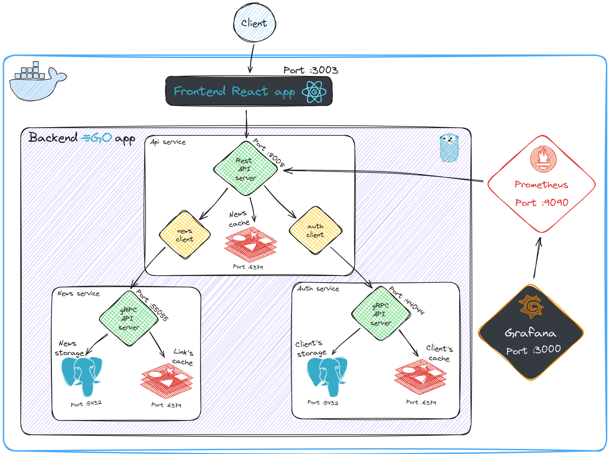

# Go Newsline

It's a full-stack web application called Go Newsline that lets people get articles about Go in one place.
Backend powered by Go. Frontend powered by React.

## Scheme



## Features

- Application backend contains three separate services (Auth, News, Api)
- Backend services communicate with each other using gRPC
- Auth service for user authentication
- User can signup and login. Using JWT Access and Refresh tokens
- Logging users can suggest news
- News service uses rss feed and website parsing to save and view articles
- Web api server on net/http (use chi router)
- RESTful routing
- Data persistence using PostgreSQL
- Cache using Redis
- Using migrations
- Frontend using React
- App uses Prometheus to collect metrics and Grafana to show them

## Development

Software requirements:

- Go
- Docker
- React
- Task (https://github.com/go-task/task)

To start the application use three commands:

```sh
$ git clone https://github.com/enchik0reo/newsWebApp

$ cd newsWebApp

$ task app_run
# This command does:
# Run docker-compose file with four containers:
# - postgres on port 5432
# - redis on port 6379
# - prometheus on port 9090
# - grafana on port 3000
# Run Migrator for database with action up
# Run Auth service on port 44044
# Run News service on port 55055
# Run Api service on port 8008
# Run Frontend on port 3003
```
- Go to http://localhost:3003/ and try app.
- Go to http://localhost:9090/ to see Prometheus.
- Go to http://localhost:3000/ to see Grafana.

To terminate services, the application uses `SIGTERM` signal (you can use Ctrl+C).